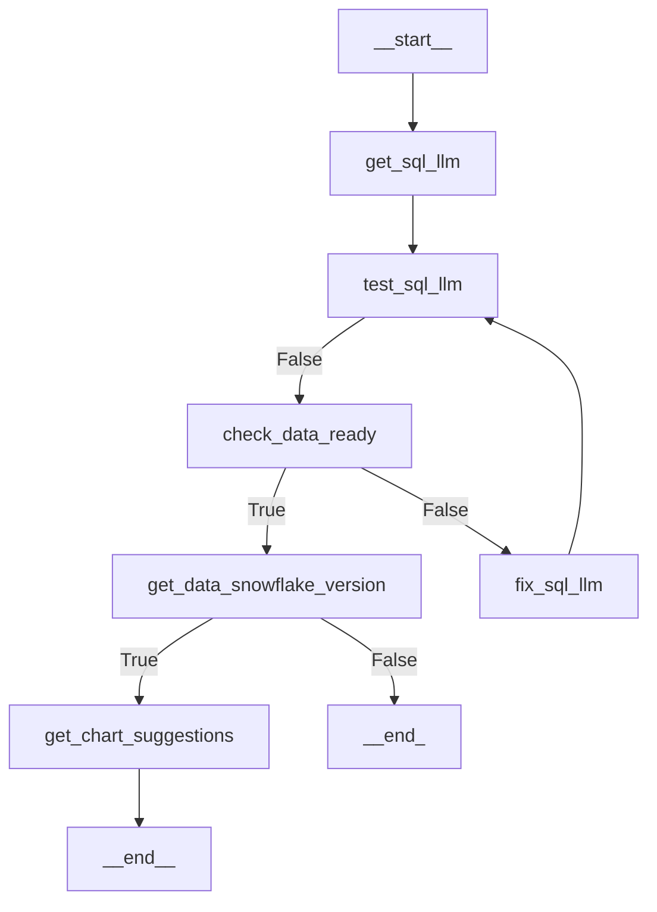

```mermaid
flowchart TD
    __start__["__start__"]
    fix_sql_llm["fix_sql_llm"]
    get_sql_llm["get_sql_llm"]
    test_sql_llm["test_sql_llm"]
    check_data_ready["check_data_ready"]
    get_data_snowflake_version["get_data_snowflake_version"]
    get_chart_suggestions["get_chart_suggestions"]
    __end__["__end__"]

    __start__ --> get_sql_llm
    fix_sql_llm --> test_sql_llm
    get_chart_suggestions --> __end__
    get_sql_llm --> test_sql_llm
    test_sql_llm -- False --> check_data_ready
    check_data_ready -- True --> get_data_snowflake_version
    check_data_ready -- False --> fix_sql_llm
    get_data_snowflake_version -- True --> get_chart_suggestions
    get_data_snowflake_version -- False --> __end_
```
